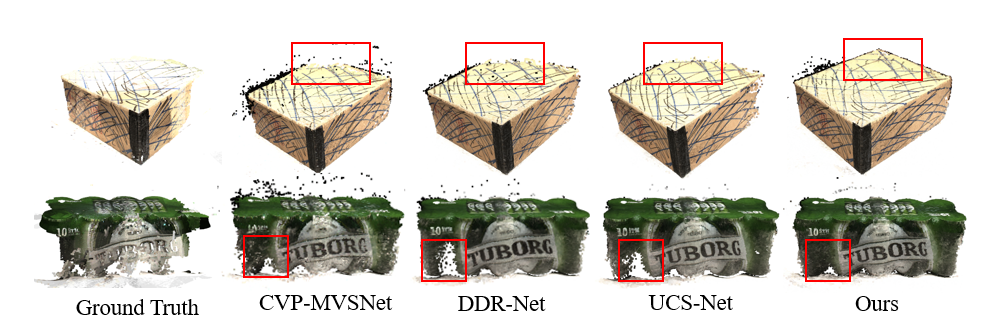

# MS-MVS
Demos and results of our method. Code will be available soon...

<h3>Requirements:</h3>
conda create -n venv python=3.9
conda activate venv
conda install pytorch==1.10.0 torchvision cudatoolkit=11.3 -c pytorch
pip install -r requirements.txt

<h3>Results on DTU dataset:</h3>
<table border="1">
    <tr>
        <td>acc.</td>
        <td>comp.</td>
        <td>overall</td>
    </tr>
    <tr>
        <td>0.363</td>
        <td>0.286</td>
        <td>0.324</td>
    </tr>
</table>

